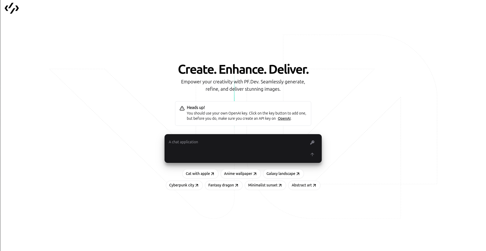
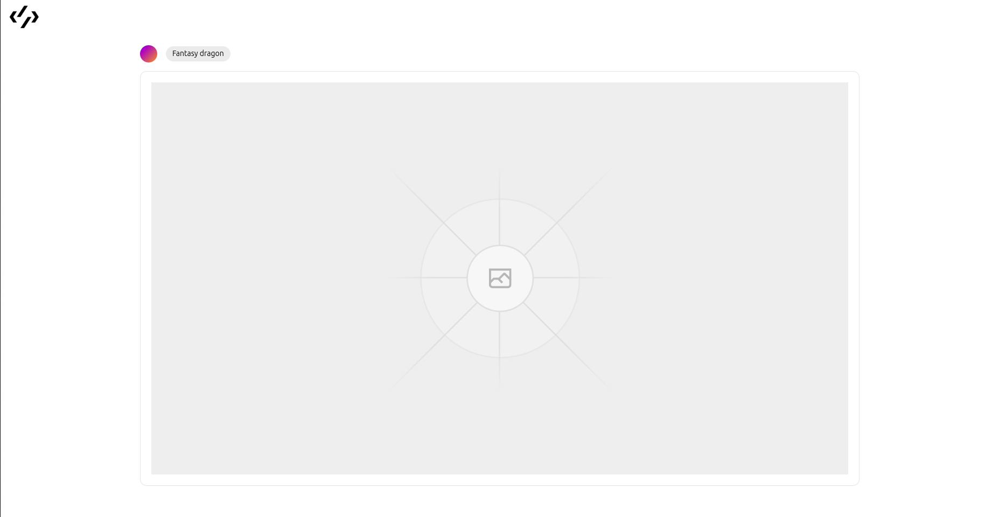
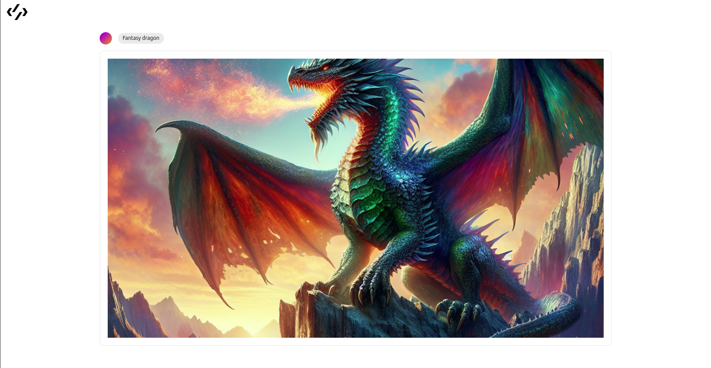

# AI Image Generator App

Welcome to the AI Image Generator app! This React application allows users to generate images using the OpenAI API for image generation. Users need to provide their OpenAI API key and a prompt to generate images based on their input.

## Features

- **Image Generation:** Users can input prompts and generate images using the OpenAI API.
- **OpenAI API Key:** Users need to provide their own OpenAI API key to access the image generation functionality.
- **User-Friendly Interface:** The app provides a simple and intuitive user interface for generating images.

## Getting Started

To run this app locally, follow these steps:

1. Clone this repository to your local machine.
2. Install dependencies by running `npm install`.
3. Start the development server by running `npm start`.

## Usage

1. Launch the app by running it locally or accessing the deployed version.
2. Enter your OpenAI API key in the designated input field.
3. Input a prompt for generating images in the provided text box.
4. Click the "Generate Image" button to generate an image based on the provided prompt.

## Preview

## Live Demo

<https://pf-dev.onrender.com/>

## Technologies Used

- React
- OpenAI API
- HTML/CSS
- Tailwind

  
## Packages Used

- Shadcn-ui

## Contributing

Contributions are welcome! Feel free to fork this repository and submit pull requests to suggest improvements or new features.

## License

This project is licensed under the MIT License - see the [LICENSE](LICENSE) file for details.
